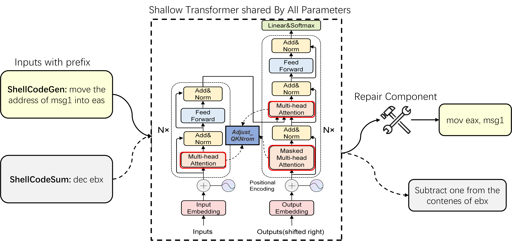
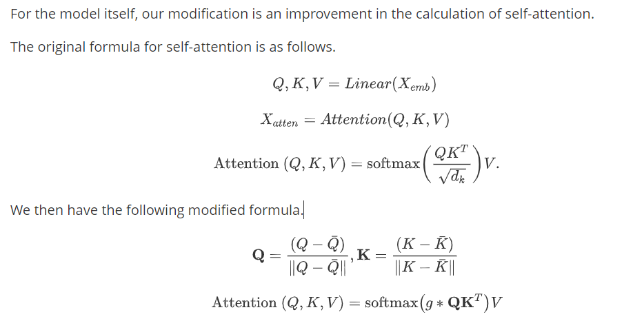

The source code and dataset for "DualSC: Automatic Generation and Summarization of Shellcode via Transformer and Dual Learning"



## Code Implementation Details



1、compute init *g0*

```python
threshold_wordcount = np.percentile([len(i) for i in train_data.src] + [len(i) for i in valid_data.src] + [len(i) for i in test_data.src], 97.5)

def scaling_factor(sequence_threshold):
    return np.log2((sequence_threshold ** 2) - sequence_threshold)

class ScaleUp(nn.Module):
    """ScaleUp"""
    def __init__(self, scale):
        super(ScaleUp, self).__init__()
        self.scale = nn.Parameter(torch.tensor(scale))

    def forward(self, x):
        return x * self.scale

#scaleup is the learnable parameter g for training.
scaleup = ScaleUp(scaling_factor(sequence_threshold))    
```

2、modify the self-attention

```python
class MultiHeadAttentionLayer(nn.Module):

    def __init__(self, d_model, n_heads, sequence_threshold=threshold_wordcount):
        super(MultiHeadAttentionLayer, self).__init__()
        assert d_model % n_heads == 0
        self.d_model = d_model
        self.scaleup = ScaleUp(scaling_factor(sequence_threshold))
        self.n_heads = n_heads
        self.head_size = d_model // n_heads
        self.fc_q = nn.Linear(d_model, d_model)
        self.fc_k = nn.Linear(d_model, d_model)
        self.fc_v = nn.Linear(d_model, d_model)
        self.fc_o = nn.Linear(d_model, d_model)

    def forward(self, query, key, value, mask):
        """
        :param Tensor[batch_size, q_len, d_model] query
        :param Tensor[batch_size, k_len, d_model] key
        :param Tensor[batch_size, v_len, d_model] value
        :param Tensor[batch_size, ..., k_len] mask
        :return Tensor[batch_size, q_len, d_model] context
        :return Tensor[batch_size, n_heads, q_len, k_len] attention_weights
        """
        Q = self.fc_q(query)  # [batch_size, q_len, d_model]
        K = self.fc_k(key)  # [batch_size, k_len, d_model]
        V = self.fc_v(value)  # [batch_size, v_len, d_model]

        Q = Q.view(Q.size(0), -1, self.n_heads, self.head_size).permute(0, 2, 1,
                                                                        3)  # [batch_size, n_heads, q_len, head_size]
        K = K.view(K.size(0), -1, self.n_heads, self.head_size).permute(0, 2, 1,
                                                                        3)  # [batch_size, n_heads, k_len, head_size]
        V = V.view(V.size(0), -1, self.n_heads, self.head_size).permute(0, 2, 1,
                                                                        3)  # [batch_size, n_heads, v_len, head_size]

        # Here is the zero mean adaptation
        mean = torch.mean(Q, dim=-1)
        mean = mean.unsqueeze(-1)
        Q = Q-mean

        mean = torch.mean(K, dim=-1)
        mean = mean.unsqueeze(-1)
        K = K-mean
        
        # Here is the modifications
        # scores = torch.matmul(Q, K.transpose(-1, -2)) # [batch_size, n_heads, q_len, k_len]
        # scores = scores / torch.sqrt(torch.FloatTensor([self.head_size]).to(Q.device))
        Q = F.normalize(Q, p=2, dim=-1)
        K = F.normalize(K, p=2, dim=-1)

        scaleup = self.scaleup
        scores = scaleup(torch.matmul(Q, K.transpose(-2, -1)))

        if mask is not None:
            scores = scores.masked_fill(mask == 0, -1e18)
        attention_weights = F.softmax(scores, dim=-1)  # [batch_size, n_heads, q_len, k_len]

        context = torch.matmul(attention_weights, V)  # [batch_size, n_heads, q_len, v_len]
        context = context.permute(0, 2, 1, 3).contiguous()  # [batch_size, q_len, n_heads, v_len]
        context = context.view(context.size(0), -1, self.d_model)
        context = self.fc_o(context)  # [batch_size, q_len, d_model]

        return context, attention_weights
```

3、dual learning in DualSC

Let the model learn two dual tasks by adding a prefix, as in T5.

## Requirements

```
pytorch 1.8
torchtext 0.5.0
numpy 1.19+
```

## How to run

just modify the settings in model/DualSC.py and run it.

## How to evaluate

just run eval.py and ACC.py.